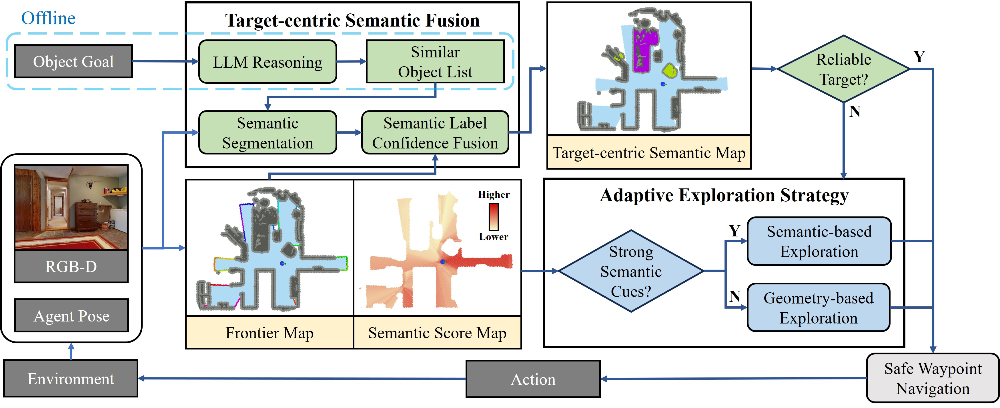
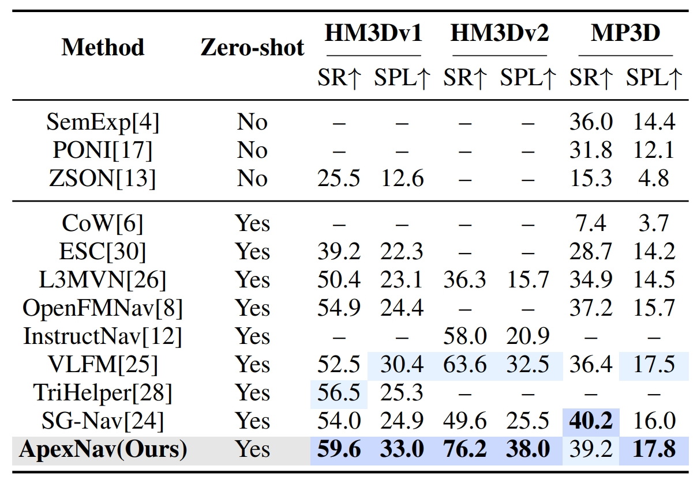

<div align="center">
    <h1> 
      ApexNav
    </h1>
    </h1>
    <h2>An Adaptive Exploration Strategy for Zero-Shot Object Navigation with Target-centric Semantic Fusion</h2>
    <strong>
      IEEE Robotics and Automation Letters
    </strong>
    <br>
        <a href="https://zager-zhang.github.io" target="_blank">Mingjie Zhang</a><sup>1</sup>,
        <a href="https://personal.hkust-gz.edu.cn/junma/people-page.html" target="_blank">Yuheng Du</a><sup>1</sup>,
        <a href="https://robotics-star.com/people" target="_blank">Chengkai Wu</a><sup>1</sup>,
        <a href="https://facultyprofiles.hkust-gz.edu.cn/faculty-personal-page/ZHOU-Jinni/eejinni" target="_blank">Jinni Zhou</a><sup>1</sup>,
        Zhenchao Qi</a><sup>1</sup>,
        <a href="https://personal.hkust-gz.edu.cn/junma/people-page.html" target="_blank">Jun Ma</a><sup>1</sup>,
        <a href="https://robotics-star.com/people" target="_blank">Boyu Zhou</a><sup>2,†</sup>
        <p>
        <h45>
            <sup>1</sup> The Hong Kong University of Science and Technology (Guangzhou). &nbsp;&nbsp;
            <br>
            <sup>2</sup> Southern University of Science and Technology. &nbsp;&nbsp;
            <br>
        </h45>
        <sup>†</sup>Corresponding Authors
    </p>
    <a href="https://arxiv.org/abs/2504.14478"></a>
    <a href='https://robotics-star.com/ApexNav'></a>

<br>

</div>

## System Overview

Code will be released soon.
<p align="center">
  
</p>

## Real-world Deployment

Please see the [project page](https://robotics-star.com/ApexNav) for more real-world experimental results.

<div align="center">
  
</div>


## Benchmark Comparisons

<p align="center">
  
</p>

## Citation 📜

```bibtex
@article{zhang2025apexnav,
  title={ApexNav: An Adaptive Exploration Strategy for Zero-Shot Object Navigation with Target-centric Semantic Fusion},
  author={Zhang, Mingjie and Du, Yuheng and Wu, Chengkai and Zhou, Jinni and Qi, Zhenchao and Ma, Jun and Zhou, Boyu},
  journal={arXiv preprint arXiv:2504.14478},
  year={2025}
}
```

